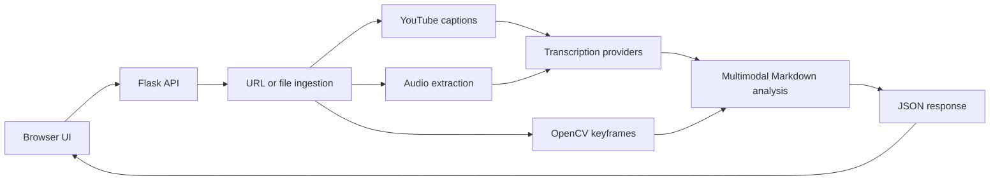

# Architecture

## System Overview

## Runtime Components

- `index.html` is a static client. It switches between URL and file modes, submits the request, renders Markdown, and offers PDF export.
- `api/index.py` owns HTTP routing, input validation, temporary-file cleanup, serverless upload limits, and JSON response shaping.
- `local_video_processor.py` owns media ingestion, YouTube transcript lookup, audio transcription, keyframe extraction, provider fallback, Markdown generation, and the Notion helper.
- `config.py` loads `.env` from the project root and exposes configuration values without storing secrets in source control.

## Processing Flow

1. The client sends JSON `{ "url": "..." }` or a multipart upload under the `file` field.
2. The API enters sandbox mode when required credentials are absent or still placeholders.
3. For a URL, the service tries YouTube captions, then media ingestion and keyframe extraction.
4. For an upload, the service writes a temporary file, extracts up to two frames in the API route, and uses the file as the audio source.
5. Transcription and multimodal analysis use the configured providers. Empty or noise-only audio is handled as a visual-only case when frames exist.
6. The API returns Markdown and analysis flags. Temporary files are removed in a `finally` block.

## Failure and Fallback Behavior

- OpenCV failure produces text-only output instead of failing the complete request.
- Provider failures fall through to another configured provider where supported.
- Missing credentials produce deterministic fallback Markdown in sandbox mode.
- Vercel rejects direct uploads larger than approximately 4.5 MB; callers should submit a media URL for larger files.
- Live Notion writing is currently disabled in the API route, even though the helper remains available for future re-enablement.

## Deployment Shape

Vercel routes `/`, `/api/index`, and `/api/config-status` through `api/index.py`. The function timeout is configured in [vercel.json](vercel.json). For local development, Flask runs on port `5000`.